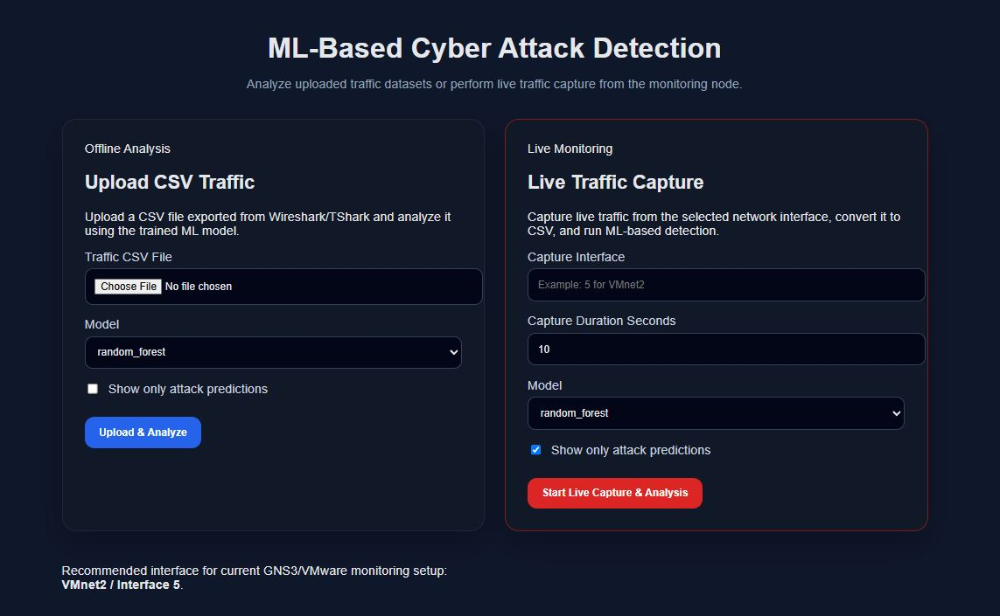

# ML-Based Cyber Attack Detection in Simulated Networks

A machine learning-based intrusion detection system built for a simulated enterprise network environment using GNS3, Kali Linux, Ubuntu Server, Windows 10, Python, Flask, Wireshark/TShark, and Scikit-Learn.

## Project Overview

This project demonstrates how live network traffic can be captured from a simulated network, processed into machine-learning-ready features, and classified as normal or malicious using trained ML models.

The lab was built in GNS3 with Kali Linux as the attacker node, Ubuntu Server as the victim server, Windows 10 as the client node, and the host machine as the monitoring system running the IDS application.

Live traffic was captured through the VMware VMnet2 interface connected to the GNS3 cloud node. The Flask dashboard allows traffic upload-based prediction and live capture-based detection.

## Key Capabilities

* Live traffic capture using TShark
* CSV upload-based prediction
* Machine learning-based attack classification
* Flask web dashboard for detection results
* Random Forest, SVM, and Isolation Forest model support
* Detection reports generated as CSV files
* Attack attribution using source and destination IPs
* Severity classification based on attack ratio and traffic behavior

## Simulated Attack Scenarios

The project includes detection testing for:

* Hping3 flood traffic
* Hydra brute-force attack
* FTP brute force
* SSH brute force
* Telnet brute force
* Nmap scanning
* Slowloris traffic
* Normal HTTP, HTTPS, FTP, and SSH traffic

## Lab Architecture

The simulated environment includes:

* Kali Linux attacker node
* Ubuntu Server victim node
* Windows 10 client node
* GNS3 network topology
* VMware VMnet2 adapter
* Host machine monitoring node
* Flask IDS dashboard
* Wireshark/TShark packet capture pipeline

## Live Capture Workflow

```text
GNS3 Network Traffic
        ↓
VMnet2 Interface
        ↓
TShark Live Capture
        ↓
CSV Feature Extraction
        ↓
Machine Learning Prediction
        ↓
Flask Dashboard Results
        ↓
Saved Detection Report
```

## Detection Results

The system successfully detected live attack traffic from the simulated network.

Example live Hping/Flood detection:

```text
Total Rows: 2020
Detected Attacks: 1998
Normal Traffic: 22
Attack Ratio: 98.91%
Severity: Critical
Top Attacker: 192.168.48.130
Top Target: 192.168.48.133
Model Used: Random Forest
```

Example Hydra brute-force detection:

```text
Total Rows: 379
Detected Attacks: 193
Normal Traffic: 186
Attack Ratio: 50.92%
Severity: High
Top Attacker: 192.168.48.130
Top Target: 192.168.48.133
Model Used: Random Forest
```

## Machine Learning Models

The project includes trained models and comparison artifacts:

* Random Forest
* Support Vector Machine
* Isolation Forest

The final live detection workflow primarily uses the Random Forest model.

## Repository Structure

```text
ML-Cyber-Attack-Detection/
│
├── app_live.py
├── requirements.txt
├── README.md
├── .gitignore
│
├── attack/
├── normal/
├── datasets/
├── docs/
├── models/
├── notebooks/
├── outputs/
├── static/
├── templates/
├── uploads/
└── utils/
```

## Screenshots and Documentation

Project documentation and screenshots are available under:

```text
docs/
├── architecture diagram/
├── network topology/
├── screenshots/
└── sequence diagrams/
```
## Project Screenshots

### Network Topology


### IDS Dashboard



### Live Hping Flood Detection


Screenshots include:

* GNS3 topology
* Flask dashboard
* Live traffic capture
* Hping flood detection
* Hydra attack detection
* Nmap attack detection
* SVM and Isolation Forest results
* Model comparison chart

## How to Run

Install dependencies:

```bash
pip install -r requirements.txt
```

Run the Flask application:

```bash
python app_live.py
```

Open the dashboard:

```text
http://127.0.0.1:5001
```

## Live Capture Interface Note

On the host machine, run:

```bash
tshark -D
```

Identify the VMware adapter connected to the GNS3 cloud node.

In this lab, the monitored interface was:

```text
9. VMware Network Adapter VMnet2
```

The dashboard was configured to capture live traffic from interface `9`.

## Video Demonstration

Project video:

https://youtu.be/IPgTUvYw5IM

Full project playlist:

https://www.youtube.com/playlist?list=PLZCT2yw0ZfllAINykD1iYHVh0qgrnZMfq

## Technologies Used

* Python
* Flask
* Scikit-Learn
* Pandas
* NumPy
* Wireshark
* TShark
* GNS3
* VMware VMnet
* Kali Linux
* Ubuntu Server
* Windows 10

## Author

**Imran Sarwar**
Network Operations | Cybersecurity | Infrastructure | Python Automation
